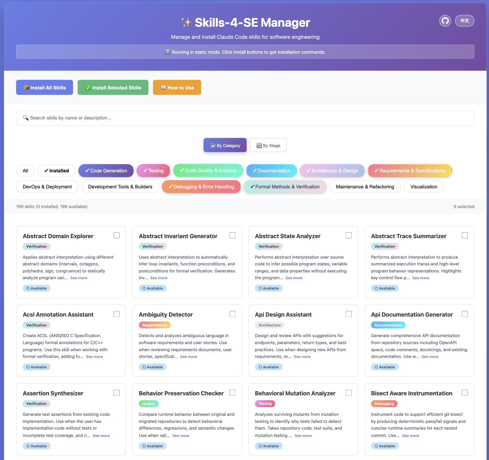

# 面向软件工程的实用技能集 (Skills-4-SE)


[](./CONTRIBUTING.md)
[](./README-zh.md)
[](./README.md)

> *注：本文档由Claude翻译而成。*

---
本仓库是**一个全面的、可重用的、面向任务的包含150+条技能的集合**，旨在支持**整个开发生命周期的软件工程活动**，包括：

> 需求理解、系统设计、实现、测试、验证、部署和维护。

✅ 与提示词集合或临时演示不同，本仓库中的每个技能都是：
- **任务导向的**（解决具体的软件工程问题）
- **可重用的**（明确指定输入和输出）
- **可组合的**（可以链接成更大的工作流或管道）
- **工具和制品感知的**（操作真实的代码、测试、规范、配置、日志）

🧰 本仓库旨在作为以下系统的**共享技能层**：
- 基于 LLM 的助手（例如 Claude Skills、智能体）
- 工具增强的软件工程工作流
- 研究原型和实证研究
- 工业自动化和开发者生产力工具

## 🌐 Skills Manager 网页界面

**[🚀 访问 Skills Manager](https://ArabelaTso.github.io/Skills-4-SE/)**

> 你也可以本地部署. 👉 [指南](./skill-manager/README.md)


<p align="center">
  
</p>

通过我们的交互式网页界面浏览、搜索和安装技能。Skills Manager 提供：
- 📦 一键安装所有 150+ 个技能
- ✅ 选择性安装特定技能
- 🔍 按类别搜索和筛选
- 📖 中英文双语帮助文档
- 🎨 现代化响应式界面

---


## ✨ 为什么是技能（而不仅仅是提示词）？

现代 LLM 功能强大，但**原始提示词很脆弱**：
- 难以复现
- 难以评估
- 难以集成到真实工作流中

我们将**技能视为一级artifact**，为**未来的元编程**做准备。

本仓库中的技能不仅仅是提示词：
- 它编码了**过程性知识**
- 它指定了**预期的输入/输出**
- 它记录了**失败模式**
- 它可以被**评估、组合和重用**

> 🤗 将本仓库视为 LLM 驱动系统的*软件工程能力标准库*。

## 目录

- [**按类别分类的技能**](#按类别分类的技能)
  - ⌨️ [代码生成](#代码生成)
  - 👩🏽‍💻 [测试](#测试)
  - ⚖️ [代码质量与分析](#代码质量与分析)
  - 📕 [文档](#文档)
  - 💡 [架构与设计](#架构与设计)
  - 📗 [需求与规范](#需求与规范)
  - 💻 [DevOps 与部署](#devops-与部署)
  - 🔀 [版本控制与协作](#版本控制与协作)
  - 📋 [项目管理与问题跟踪](#项目管理与问题跟踪)
  - 💬 [团队沟通](#团队沟通)
  - 📊 [监控与错误跟踪](#监控与错误跟踪)
  - 🗄️ [数据库与后端服务](#数据库与后端服务)
  - 🛠️ [开发工具与构建器](#开发工具与构建器)
  - 🔗 [集成与 Webhooks](#集成与-webhooks)
  - 🔨 [调试与错误处理](#调试与错误处理)
  - ✅ [形式化方法与验证](#形式化方法与验证)
  - 🔧 [维护与重构](#维护与重构)
  - 👀 [可视化](#可视化)
- [**按阶段分类的技能**](#-按阶段分类的技能)
  - 📕 [需求分析](#-需求)
  - 💡[软件设计](#-软件设计)
  - ⌨️ [实现](#️-实现)
  - 👩🏽‍💻 [测试](#-测试-1)
  - ✅ [验证](#-验证)
  - 💻 [部署](#-部署)
  - 🔧 [维护](#-维护-1)
- 📖 [使用方法](#使用方法)
- 🫶 [贡献](#贡献)
- 🎯 [愿景](#-愿景)
- 🙏 [参考](#参考)


## 按类别分类的技能

### 代码生成

**[函数/类生成器](./function-class-generator/)**
- 从规范生成函数和类
- 支持多种编程语言
- 包含类型提示、文档和错误处理

**[模块/组件生成器](./module-component-generator/)**
- 从接口契约构建完整模块
- 生成分层架构（模型、仓储、服务）
- 支持 Python 和 Java 的设计模式

**[模板代码生成器](./template-code-generator/)**
- 从模板创建样板代码
- 支持常见模式和框架
- 可定制的模板适用于不同用例

**[规范驱动生成](./specification-driven-generation/)**
- 从形式化规范生成代码
- 确保规范合规性
- 验证生成的代码是否符合需求

**[测试驱动生成](./test-driven-generation/)**
- 从测试用例生成实现
- 遵循 TDD 原则
- 确保测试覆盖率

**[增量式 Python 编程器](./incremental-python-programmer/)**
- 根据自然语言描述在 Python 仓库中实现新功能
- 生成全面的单元测试和集成测试
- 确保所有测试通过并遵循现有代码模式

**[增量式 Java 编程器](./incremental-java-programmer/)**
- 根据自然语言描述在 Java 仓库中实现新功能
- 支持 Maven 和 Gradle 构建系统
- 生成 JUnit 测试并确保所有测试成功通过

**[前端设计](./anthropics-skills-SE-skills/frontend-design/)** *(来源: anthropics-skills-SE-skills)*
- 创建独特的、生产级别的前端界面，具有高设计质量
- 生成富有创意、精美的 Web 组件、页面和应用程序
- 避免通用的 AI 美学，采用大胆、有意图的设计选择

**[伪代码提取器](./pseudocode-extractor/)**
- 从实现中提取高级伪代码
- 简化代码以便编写规范
- 辅助算法理解

### 测试

### 测试

**[单元测试生成器](./unit-test-generator/)**
- 为函数和类生成单元测试
- 支持多种测试框架
- 包含边界情况和断言

**[集成测试生成器](./integration-test-generator/)**
- 为系统组件创建集成测试
- 测试组件交互
- 包含设置和清理逻辑

**[Java 测试更新器](./java-test-updater/)**
- 在重构后更新 Java 测试以适配新代码版本
- 处理签名变更、重构和行为修改
- 更新方法调用、断言、模拟对象并确保测试通过

**[不稳定测试检测器](./flaky-test-detector/)**
- 识别非确定性测试
- 分析测试执行模式
- 建议常见不稳定模式的修复方法

**[测试预言生成器](./test-oracle-generator/)**
- 为测试用例生成预期输出
- 创建断言和验证逻辑
- 支持基于属性的测试

**[边界情况生成器](./edge-case-generator/)**
- 识别并生成边界情况测试
- 覆盖边界条件
- 包含极端情况和错误场景

**[定向测试输入生成器](./directed-test-input-generator/)**
- 生成针对性的测试输入
- 专注于特定代码路径
- 使用符号执行技术

**[模糊测试输入生成器](./fuzzing-input-generator/)**
- 创建随机化测试输入
- 发现意外行为
- 支持基于变异的模糊测试

**[测试套件优先级排序器](./test-suite-prioritizer/)**
- 优先排序测试执行顺序
- 优化早期故障检测
- 考虑测试依赖关系和覆盖率

**[覆盖率增强器](./coverage-enhancer/)**
- 识别未覆盖的代码路径
- 生成测试以提高覆盖率
- 报告覆盖率指标

**[测试用例文档](./test-case-documentation/)**
- 记录测试用例及其目的
- 解释测试场景和预期结果
- 维护测试文档

**[Python 测试更新器](./python-test-updater/)**
- 更新 Python 测试以适配新代码版本
- 修复由于签名和行为变更导致的测试失败
- 分析代码差异并相应更新断言

**[需求到测试转换器](./req-to-test/)**
- 将需求转换为测试用例
- 确保需求覆盖
- 将测试追溯到需求

**[Python 回归测试生成器](./python-regression-test-generator/)**
- 自动为 Python 代码库生成回归测试
- 分析新旧代码版本之间的变化
- 迁移现有测试并为依赖项创建模拟对象

**[Java 回归测试生成器](./java-regression-test-generator/)**
- 自动为 Java 代码库生成回归测试
- 支持 JUnit 和 TestNG 框架
- 处理 Maven 和 Gradle 构建系统

**[模拟测试生成器](./mocking-test-generator/)**
- 为外部依赖项生成测试模拟对象
- 为 I/O 操作和副作用函数创建存根
- 支持多种模拟框架

**[测试引导的错误检测器](./test-guided-bug-detector/)**
- 使用测试执行信息检测错误
- 分析测试失败以识别根本原因
- 根据测试结果建议错误修复

**[Test App Automation](./awesome-claude-skills-SE-skills/test-app-automation/)** *(来源: awesome-claude-skills)*
- 自动化应用程序测试工作流，包括单元测试、集成测试和端到端测试

**[WebApp Testing](./awesome-claude-skills-SE-skills/webapp-testing/)** *(来源: awesome-claude-skills)*
- 专门用于 Web 应用程序测试的自动化，包括 UI 测试和浏览器自动化

**[Web Application Testing](./anthropics-skills-SE-skills/webapp-testing/)** *(来源: anthropics-skills-SE-skills)*
- 使用 Playwright 与本地 Web 应用程序交互和测试的工具包
- 支持验证前端功能、调试 UI 行为和捕获屏幕截图
- 包含用于管理服务器生命周期的辅助脚本

### 代码质量与分析

**[代码审查助手](./code-review-assistant/)**
- 执行自动化代码审查
- 识别问题并提出改进建议
- 检查编码标准合规性

**[代码异味检测器](./code-smell-detector/)**
- 检测代码异味和反模式
- 建议重构机会
- 按严重程度分类异味

**[设计异味检测器](./design-smell-detector/)**
- 识别架构和设计问题
- 检测设计原则违规
- 建议设计改进

**[代码优化器](./code-optimizer/)**
- 优化代码性能
- 识别瓶颈
- 建议算法改进

**[死代码消除器](./dead-code-eliminator/)**
- 识别未使用的代码
- 安全删除死代码
- 报告消除机会

**[技术债务分析器](./technical-debt-analyzer/)**
- 识别技术债务
- 量化债务影响
- 优先处理债务减少

**[代码模式提取器](./code-pattern-extractor/)**
- 分析代码库以识别可重用的代码模式和重复代码
- 生成包含重构建议的模式目录
- 为高价值模式创建可重用的模板代码

**[代码搜索助手](./code-search-assistant/)**
- 在仓库中搜索与给定代码片段相关的代码
- 根据调用链、文本和功能相似性对结果进行排名
- 输出带有匹配代码片段的排名文件列表

**[组件边界识别器](./component-boundary-identifier/)**
- 识别模块/组件边界
- 检测边界违规
- 分析架构分离

**[静态错误检测器](./static-bug-detector/)**
- 通过静态分析检测潜在的功能性错误
- 识别空指针解引用、错误条件、不可达代码
- 报告可疑位置并提供解释和置信度

**[语义错误检测器](./semantic-bug-detector/)**
- 检测违反预期程序行为的语义错误
- 识别逻辑错误、不正确的 API 使用和语义不一致
- 提供详细的解释和修复建议

**[静态漏洞检测器](./static-vulnerability-detector/)**
- 通过静态代码分析检测安全漏洞
- 识别注入缺陷、身份验证问题和加密失败
- 报告漏洞并提供严重性评级和修复指导

**[漏洞模式匹配器](./vulnerability-pattern-matcher/)**
- 通过匹配已知漏洞模式检测安全漏洞
- 解释模式为何有风险以及可利用条件
- 支持 CVE 风格模式和不安全的编码习惯

**[可利用性分析器](./exploitability-analyzer/)**
- 分析检测到的漏洞的可利用性
- 评估攻击复杂度、所需权限和影响
- 提供 CVSS 评分和利用场景

**[漏洞根因分析器](./vulnerability-root-cause-analyzer/)**
- 分析安全漏洞的根本原因
- 通过代码流追踪漏洞来源
- 提供详细的修复策略

**[安全补丁顾问](./security-patch-advisor/)**
- 为识别的漏洞推荐安全补丁
- 生成安全的代码替代方案
- 验证补丁有效性

**[代码摘要生成器](./code-summarizer/)**
- 生成代码功能的简洁摘要
- 解释代码目的和关键操作
- 辅助代码理解和文档编写

### 文档

**[API 文档生成器](./api-documentation-generator/)**
- 生成 API 文档
- 创建参考文档
- 包含使用示例

**[代码注释生成器](./code-comment-generator/)**
- 生成内联代码注释
- 解释复杂逻辑
- 遵循文档标准

**[Markdown 文档结构化工具](./markdown-document-structurer/)**
- 将 Markdown 文档重组为结构良好的格式
- 修复标题层次结构并生成目录
- 标准化格式并提高可读性

**[README 生成器](./readme-generator/)**
- 生成全面、用户友好的 README.md 文件
- 包含项目介绍、先决条件和设置说明
- 提供可执行的使用示例和仓库结构概览

**[变更日志生成器](./change-log-generator/)**
- 从提交创建变更日志
- 按类型分类变更
- 遵循语义化版本控制

**[代码变更总结器](./code-change-summarizer/)**
- 从代码变更生成结构化的拉取请求描述
- 记录带有迁移指南的破坏性变更
- 添加测试说明和上下文增强

**[发布说明编写器](./release-notes-writer/)**
- 编写发布说明
- 突出新功能和修复
- 面向最终用户

**[遗留代码总结器](./legacy-code-summarizer/)**
- 总结遗留代码库
- 解释代码功能
- 帮助理解旧代码

**[Python 仓库快速入门](./python-repo-quickstart/)**
- 快速分析 Python 仓库
- 识别项目类型、入口点和依赖项
- 生成设置和执行说明

**[错误解释生成器](./error-explanation-generator/)**
- 解释错误消息
- 提供上下文和解决方案
- 帮助调试

### 架构与设计

**[API 设计助手](./api-design-assistant/)**
- 协助 API 设计
- 建议 RESTful 模式
- 验证 API 一致性

**[设计模式建议器](./design-pattern-suggestor/)**
- 建议适当的设计模式
- 解释模式适用性
- 提供实现指导

**[配置生成器](./configuration-generator/)**
- 生成配置文件
- 支持多种格式（YAML、JSON、XML）
- 验证配置模式

**[依赖解析器](./dependency-resolver/)**
- 解决依赖冲突
- 建议兼容版本
- 分析依赖树

### 需求与规范

**[需求总结器](./requirement-summarizer/)**
- 总结需求文档
- 提取关键需求
- 按优先级组织

**[需求覆盖检查器](./requirement-coverage-checker/)**
- 检查需求覆盖
- 识别实现中的差距
- 将需求追溯到代码

**[需求比较报告器](./requirement-comparison-reporter/)**
- 比较新旧需求文档
- 将需求变更映射到代码组件
- 生成详细的 Markdown 格式修改计划

**[歧义检测器](./ambiguity-detector/)**
- 检测模糊的需求
- 突出不清晰的规范
- 建议澄清

**[场景生成器](./scenario-generator/)**
- 生成使用场景
- 创建用户故事
- 开发测试场景

**[规范生成器](./specification-generator/)**
- 生成形式化规范
- 将自然语言转换为规范
- 验证规范完整性

**[自然语言到约束转换器](./nl-to-constraints/)**
- 将自然语言需求转换为形式化约束
- 支持约束语言
- 验证约束一致性

### DevOps 与部署

**[CI 流水线合成器](./ci-pipeline-synthesizer/)**
- 生成用于自动化构建和测试的 CI 流水线配置
- 支持 GitHub Actions，包含依赖缓存和矩阵测试
- 包含 Node.js、Python、Go 和 Rust 项目的模板

**[CD 流水线生成器](./cd-pipeline-generator/)**
- 创建用于自动化部署的 CD 流水线配置
- 支持 AWS、GCP 和 Azure 云平台
- 包含环境分离、审批门和回滚功能

**[容器化助手](./containerization-assistant/)**
- 创建 Dockerfile 和容器配置
- 优化容器镜像
- 支持多阶段构建

**[环境设置助手](./environment-setup-assistant/)**
- 生成环境设置脚本
- 管理依赖和配置
- 支持多个平台

**[回滚策略顾问](./rollback-strategy-advisor/)**
- 建议回滚策略
- 规划部署回退
- 最小化停机时间

**[CircleCI Automation](./awesome-claude-skills-SE-skills/circleci-automation/)** *(来源: awesome-claude-skills)*
- 自动化 CircleCI 任务：触发流水线、监控工作流/作业、检索构建产物和测试元数据

**[Buildkite Automation](./awesome-claude-skills-SE-skills/buildkite-automation/)** *(来源: awesome-claude-skills)*
- 自动化 Buildkite CI/CD 操作，用于流水线管理和构建自动化

**[AppVeyor Automation](./awesome-claude-skills-SE-skills/appveyor-automation/)** *(来源: awesome-claude-skills)*
- 自动化 AppVeyor 持续集成和部署，支持 Windows、Linux 和 macOS 构建

**[Appcircle Automation](./awesome-claude-skills-SE-skills/appcircle-automation/)** *(来源: awesome-claude-skills)*
- 使用 Appcircle 自动化移动 CI/CD 工作流，用于 iOS 和 Android 应用构建

**[Docker Hub Automation](./awesome-claude-skills-SE-skills/docker-hub-automation/)** *(来源: awesome-claude-skills)*
- 自动化 Docker Hub 操作 - 管理组织、仓库、团队和 webhooks

**[Vercel Automation](./awesome-claude-skills-SE-skills/vercel-automation/)** *(来源: awesome-claude-skills)*
- 自动化 Vercel 部署、域名、DNS、环境变量、项目和团队

**[DigitalOcean Automation](./awesome-claude-skills-SE-skills/digital-ocean-automation/)** *(来源: awesome-claude-skills)*
- 自动化 DigitalOcean 云基础设施管理，包括 Droplets、数据库和网络

**[Cloudflare Automation](./awesome-claude-skills-SE-skills/cloudflare-automation/)** *(来源: awesome-claude-skills)*
- 自动化 Cloudflare CDN、DNS、安全和性能优化任务

**[NPM Automation](./awesome-claude-skills-SE-skills/npm-automation/)** *(来源: awesome-claude-skills)*
- 自动化 JavaScript/Node.js 项目的 NPM 包管理任务

### 版本控制与协作

**[GitHub Automation](./awesome-claude-skills-SE-skills/github-automation/)** *(来源: awesome-claude-skills)*
- 自动化 GitHub 仓库、问题、拉取请求、分支、CI/CD 和权限管理

**[GitLab Automation](./awesome-claude-skills-SE-skills/gitlab-automation/)** *(来源: awesome-claude-skills)*
- 自动化 GitLab 项目管理、问题、合并请求、流水线和分支

**[Bitbucket Automation](./awesome-claude-skills-SE-skills/bitbucket-automation/)** *(来源: awesome-claude-skills)*
- 自动化 Bitbucket 仓库、拉取请求、分支、问题和工作区管理

**[Sourcegraph Automation](./awesome-claude-skills-SE-skills/sourcegraph-automation/)** *(来源: awesome-claude-skills)*
- 自动化 Sourcegraph 代码搜索和导航操作

### 项目管理与问题跟踪

**[Jira Automation](./awesome-claude-skills-SE-skills/jira-automation/)** *(来源: awesome-claude-skills)*
- 自动化 Jira 任务：问题、项目、冲刺、看板、评论和敏捷工作流

**[Linear Automation](./awesome-claude-skills-SE-skills/linear-automation/)** *(来源: awesome-claude-skills)*
- 自动化 Linear 任务：问题、项目、周期、团队和标签，用于现代问题跟踪

**[Confluence Automation](./awesome-claude-skills-SE-skills/confluence-automation/)** *(来源: awesome-claude-skills)*
- 自动化 Confluence 页面创建、内容搜索、空间管理和文档

### 团队沟通

**[Slack Automation](./awesome-claude-skills-SE-skills/slack-automation/)** *(来源: awesome-claude-skills)*
- 自动化 Slack 消息、频道管理、搜索、反应和线程

**[Slackbot Automation](./awesome-claude-skills-SE-skills/slackbot-automation/)** *(来源: awesome-claude-skills)*
- 创建和管理 Slack 机器人，用于自动化团队沟通和工作流集成

**[Discord Automation](./awesome-claude-skills-SE-skills/discord-automation/)** *(来源: awesome-claude-skills)*
- 自动化 Discord 服务器管理、消息和机器人操作，用于开发者社区

**[Discordbot Automation](./awesome-claude-skills-SE-skills/discordbot-automation/)** *(来源: awesome-claude-skills)*
- 构建和管理 Discord 机器人，用于自动化社区参与和通知

### 监控与错误跟踪

**[Sentry Automation](./awesome-claude-skills-SE-skills/sentry-automation/)** *(来源: awesome-claude-skills)*
- 自动化 Sentry 任务：管理问题/事件、配置警报、跟踪发布和监控项目

**[Datadog Automation](./awesome-claude-skills-SE-skills/datadog-automation/)** *(来源: awesome-claude-skills)*
- 自动化 Datadog 任务：查询指标、搜索日志、管理监控器/仪表板，实现全栈可观测性

**[Bugsnag Automation](./awesome-claude-skills-SE-skills/bugsnag-automation/)** *(来源: awesome-claude-skills)*
- 自动化 Bugsnag 错误监控和应用程序崩溃报告

**[BugBug Automation](./awesome-claude-skills-SE-skills/bugbug-automation/)** *(来源: awesome-claude-skills)*
- 使用 BugBug 自动化错误跟踪和测试自动化工作流

**[BugHerd Automation](./awesome-claude-skills-SE-skills/bugherd-automation/)** *(来源: awesome-claude-skills)*
- 使用 BugHerd 直接在网站上管理可视化反馈和错误跟踪

**[PagerDuty Automation](./awesome-claude-skills-SE-skills/pagerduty-automation/)** *(来源: awesome-claude-skills)*
- 自动化 PagerDuty 任务：管理事件、服务、排班、升级策略和值班轮换

### 数据库与后端服务

**[Supabase Automation](./awesome-claude-skills-SE-skills/supabase-automation/)** *(来源: awesome-claude-skills)*
- 自动化 Supabase 数据库查询、表管理、存储、边缘函数和 SQL 执行

### 开发工具与构建器

**[Artifacts Builder](./awesome-claude-skills-SE-skills/artifacts-builder/)** *(来源: awesome-claude-skills)*
- 使用 React、Tailwind CSS 和 shadcn/ui 创建精细的多组件 claude.ai HTML 制品

**[Web Artifacts Builder](./anthropics-skills-SE-skills/web-artifacts-builder/)** *(来源: anthropics-skills-SE-skills)*
- 用于创建精细的多组件 claude.ai HTML 制品的工具套件
- 使用现代前端 Web 技术（React、Tailwind CSS、shadcn/ui）
- 包含用于生成单文件制品的打包脚本

**[MCP Builder](./awesome-claude-skills-SE-skills/mcp-builder/)** *(来源: awesome-claude-skills)*
- 创建高质量 MCP 服务器的指南，使 LLM 能够与外部服务交互

**[Code Interpreter Automation](./awesome-claude-skills-SE-skills/codeinterpreter-automation/)** *(来源: awesome-claude-skills)*
- 在隔离环境中执行代码，用于数据分析、可视化和计算任务

### 集成与 Webhooks

**[Hookdeck Automation](./awesome-claude-skills-SE-skills/hookdeck-automation/)** *(来源: awesome-claude-skills)*
- 管理 webhook 基础设施、路由和监控，实现可靠的事件驱动架构

### 调试与错误处理

**[Bug 定位器](./bug-localization/)**
- 在代码中定位 bug
- 分析堆栈跟踪和日志
- 建议可能的 bug 位置

**[Bug 到补丁生成器](./bug-to-patch-generator/)**
- 为识别的 bug 生成补丁
- 创建最小修复
- 包含修复的测试用例

**[运行时错误解释器](./runtime-error-explainer/)**
- 解释运行时错误
- 提供调试指导
- 建议修复方法

**[回归根因分析器](./regression-root-cause-analyzer/)**
- 分析回归失败
- 识别根本原因
- 建议修复方法

**[冲突分析器](./conflict-analyzer/)**
- 分析合并冲突
- 建议冲突解决方案
- 解释冲突的变更

**[反例调试器](./counterexample-debugger/)**
- 调试形式化验证反例
- 解释反例为何违反规范
- 建议消除反例的修复方法

**[问题报告生成器](./issue-report-generator/)**
- 从失败的测试自动生成问题报告
- 包含根本原因分析和复现步骤
- 提供可操作的调试信息

### 形式化方法与验证

**[ACSL 注解助手](./acsl-annotation-assistant/)**
- 协助 ACSL 注解
- 生成函数契约
- 验证注解正确性

**[断言合成器](./assertion-synthesizer/)**
- 合成程序断言
- 生成不变量和前置/后置条件
- 验证断言正确性

**[不变量推断器](./invariant-inference/)**
- 推断循环和程序不变量
- 使用静态和动态分析
- 验证推断的不变量

**[静态推理验证器](./static-reasoning-verifier/)**
- 使用静态分析验证代码
- 检查正确性属性
- 报告验证结果

**[符号执行助手](./symbolic-execution-assistant/)**
- 协助符号执行
- 生成路径约束
- 探索执行路径

**[反例生成器](./counterexample-generator/)**
- 为失败的证明生成反例
- 从反例创建测试用例
- 帮助理解验证失败

**[反例解释器](./counterexample-explainer/)**
- 解释反例
- 提供调试见解
- 建议修复方法

**[形式化规范生成器](./formal-spec-generator/)**
- 从自然语言需求生成形式化规范
- 支持多种规范语言（Dafny、Coq、Isabelle）
- 验证规范的完整性和一致性

**[程序到模型提取器](./program-to-model-extractor/)**
- 从命令式程序提取形式化模型
- 支持多种目标语言（Dafny、Coq、TLA+）
- 在提取的模型中保持程序语义

**[命令式到 Coq 模型提取器](./imperative-to-coq-model-extractor/)**
- 从命令式程序提取 Coq 模型
- 处理状态、控制流和数据结构
- 生成可执行的 Coq 规范

**[Python 到 Dafny 翻译器](./python-to-dafny-translator/)**
- 将 Python 代码翻译为 Dafny 以进行验证
- 生成函数契约和循环不变量
- 在 Dafny 中保持 Python 语义

**[Python 到 Lean4 翻译器](./python-to-lean4-translator/)**
- 将 Python 代码翻译为 Lean4 以进行形式化验证
- 生成带有证明的类型安全 Lean4 代码
- 处理 Python 习惯用法和数据结构

**[C/C++ 到 Lean4 翻译器](./c-cpp-to-lean4-translator/)**
- 将 C/C++ 代码翻译为 Lean4 以进行验证
- 处理指针、内存管理和底层操作
- 生成安全的 Lean4 等价物

**[C++ 到 Dafny 翻译器](./cpp-to-dafny-translator/)**
- 将 C++ 代码翻译为 Dafny 以进行验证
- 处理面向对象特性和模板
- 生成可验证的 Dafny 规范

**[程序正确性证明器](./program-correctness-prover/)**
- 使用形式化方法证明程序正确性
- 为规范生成证明
- 验证正确性属性

**[证明骨架生成器](./proof-skeleton-generator/)**
- 为验证任务生成证明骨架
- 提供证明结构和关键引理
- 辅助交互式定理证明

**[证明失败解释器](./proof-failure-explainer/)**
- 解释 Isabelle 或 Coq 证明为何失败
- 识别缺失的假设和不正确的目标
- 建议证明修复策略

**[证明重构助手](./proof-refactoring-assistant/)**
- 重构证明以提高可读性和可维护性
- 提取辅助引理并简化证明结构
- 保持证明语义

**[证明跟踪摘要器](./proof-trace-summarizer/)**
- 总结定理证明器的证明跟踪
- 突出关键证明步骤和决策
- 辅助证明理解

**[证明携带代码生成器](./proof-carrying-code-generator/)**
- 生成嵌入正确性证明的证明携带代码
- 确保部署时的代码正确性
- 支持多种验证框架

**[已验证规范-代码映射器](./verified-spec-code-mapper/)**
- 建立形式化规范与已验证代码之间的可追溯性
- 将规范映射到实现组件
- 报告验证覆盖率

**[验证边界报告器](./verification-boundary-reporter/)**
- 识别已验证和未验证代码之间的边界
- 报告验证覆盖率差距
- 建议验证优先级

**[已验证伪代码提取器](./verified-pseudocode-extractor/)**
- 提取带有验证注解的伪代码
- 在伪代码中保持正确性属性
- 连接代码和规范

**[引理发现助手](./lemma-discovery-assistant/)**
- 发现用于完成证明的辅助引理
- 根据证明上下文建议引理
- 辅助交互式定理证明

**[策略建议助手](./tactic-suggestion-assistant/)**
- 为 Coq、Isabelle 或 Lean 建议证明策略
- 根据证明状态推荐策略
- 加速交互式证明开发

**[精化步骤生成器](./refinement-step-generator/)**
- 为逐步程序开发生成精化步骤
- 确保精化正确性
- 支持精化演算

**[抽象域探索器](./abstract-domain-explorer/)**
- 使用不同的抽象域应用抽象解释
- 推断不变量、值范围和变量关系
- 支持区间、八边形、多面体和其他域

**[抽象不变量生成器](./abstract-invariant-generator/)**
- 使用抽象解释生成程序不变量
- 支持多种抽象域
- 验证生成的不变量

**[抽象状态分析器](./abstract-state-analyzer/)**
- 使用抽象解释分析程序状态
- 计算程序点的抽象状态
- 报告可达性和安全属性

**[抽象跟踪摘要器](./abstract-trace-summarizer/)**
- 使用抽象总结执行跟踪
- 识别关键跟踪模式
- 辅助跟踪分析和调试

**[控制流抽象生成器](./control-flow-abstraction-generator/)**
- 生成抽象控制流表示
- 简化控制流以便分析
- 支持谓词抽象

**[证明库顾问](./library-for-proof-advisor/)**
- 为特定任务推荐已验证的库
- 建议具有形式化正确性保证的库
- 提供集成指导

**[需求增强器](./requirement-enhancer/)**
- 用形式化属性增强需求
- 为规范添加精确性和完整性
- 验证需求一致性

### 维护与重构

**[代码重构助手](./code-refactoring-assistant/)**
- 建议重构机会
- 应用重构模式
- 确保行为保持

**[废弃 API 更新器](./deprecated-api-updater/)**
- 更新废弃的 API 使用
- 建议现代替代方案
- 自动化 API 迁移

**[代码翻译器](./code-translation/)**
- 在语言之间翻译代码
- 保持功能
- 适应目标语言习惯用法

### 可视化

**[系统图生成器](./system-diagram-generator/)**
- 创建系统架构图
- 支持 Mermaid、PlantUML、Graphviz
- 生成数据流和部署图


## 🔁 按阶段分类的技能

> 软件开发生命周期（SDLC）中的阶段

### 📕 **需求分析**
- **需求分析**
    - [歧义检测器](ambiguity-detector) – 自动检测需求中的模糊或含糊陈述
    - [需求总结器（长）](requirement-summarizer) – 从需求文档中提取核心功能、约束和优先级，输出 markdown 文件
    - [需求总结器（短）](requirement-summary) – 生成简洁、结构化的需求摘要，便于团队快速理解
    - [需求冲突分析器](conflict-analyzer) – 检测需求之间的冲突或矛盾

- **可追溯性与覆盖**
    - [需求到测试转换器](req-to-test) – 从需求自动生成测试用例
    - [需求到约束转换器](nl-to-constraints) -- 将自然语言需求转换为形式化规范和约束（结构化、可测试的规范，带有明确的约束）
    - [可追溯性矩阵生成器](traceability-matrix-generator) – 构建连接需求 → 设计 → 实现 → 测试的可追溯性矩阵
    - [需求覆盖检查器](requirement-coverage-checker) – 检查现有设计/代码是否覆盖所有需求
    - [需求比较报告器](requirement-comparison-reporter) – 比较需求版本，将变更映射到代码组件，并生成修改计划

- **文档与沟通**
    - [需求文档格式化器](markdown-document-structurer) – 生成清晰、标准化的需求文档

- **场景与用户故事生成**
    - [场景生成器](scenario-generator) – 基于需求生成使用场景和用户故事

- **项目管理与问题跟踪**
    - [Jira 自动化](awesome-claude-skills-SE-skills/jira-automation) *(来源: awesome-claude-skills)* – 自动化 Jira 任务：问题、项目、冲刺、看板、评论和敏捷工作流
    - [Linear 自动化](awesome-claude-skills-SE-skills/linear-automation) *(来源: awesome-claude-skills)* – 自动化 Linear 任务：问题、项目、周期、团队和标签，用于现代问题跟踪
    - [Confluence 自动化](awesome-claude-skills-SE-skills/confluence-automation) *(来源: awesome-claude-skills)* – 自动化 Confluence 页面创建、内容搜索、空间管理和文档


### 💡 **软件设计**
- **架构与高层设计**
    - [系统图生成器](system-diagram-generator) – 创建系统结构的可视化表示
    - [设计模式建议器](design-pattern-suggestor) – 为给定需求推荐合适的设计模式

- **接口与 API 设计**
    - [API 设计助手](api-design-assistant) – 建议 API 端点、参数和返回类型

- **设计质量与分析**
    - [设计异味检测器](design-smell-detector) – 识别潜在问题，如高耦合或低内聚
    - [组件边界识别器](component-boundary-identifier) – 识别模块/组件边界并检测边界违规
    - [配置生成器](configuration-generator) – 为应用程序、服务或基础设施生成配置文件
    - [依赖解析器](dependency-resolver) – 识别和管理软件依赖

### ⌨️ **代码实现**
- **规范到代码**
    - [函数/类生成器](function-class-generator) – 从形式化规范或设计描述生成函数或类
    - [模块/组件生成器](module-component-generator) – 基于接口契约构建更大的组件或模块
    - [模板/骨架代码生成器](template-code-generator) – 自动生成样板代码或项目模板/骨架
    - [增量式 Python 编程器](incremental-python-programmer) – 根据自然语言描述在 Python 仓库中实现新功能，并自动生成测试
    - [增量式 Java 编程器](incremental-java-programmer) – 根据自然语言描述在 Java 仓库（Maven/Gradle）中实现新功能，并生成 JUnit 测试
    - [前端设计](anthropics-skills-SE-skills/frontend-design) *(来源: anthropics-skills)* – 创建具有高设计质量的独特生产级前端界面
    - [伪代码提取器](pseudocode-extractor) – 从实现中提取高级伪代码以便编写规范

- **重构与优化**
    - [重构助手](code-refactoring-assistant) – 建议持续的代码改进以增强可维护性
    - [代码优化器](code-optimizer) – 改进代码性能、内存使用或效率
    - [死代码消除器](dead-code-eliminator) – 识别并删除未使用或冗余的代码
    - [代码审查助手](code-review-assistant) - 识别 bug、安全问题、性能问题、代码质量问题和最佳实践违规
    - [不良代码异味检测](code-smell-detector) - 识别并报告可能表明设计不良或可维护性问题的代码异味
    - [技术债务分析器](technical-debt-analyzer) – 识别技术债务并量化债务影响
    - [代码模式提取器](code-pattern-extractor) – 分析代码库以识别可重用的代码模式和重复代码
    - [代码搜索助手](code-search-assistant) – 使用相似性分析在仓库中搜索与给定代码片段相关的代码
    - [组件边界识别器](component-boundary-identifier) – 识别模块/组件边界并分析架构分离
    - [代码摘要生成器](code-summarizer) – 生成代码功能和目的的简洁摘要

- **安全与漏洞分析**
    - [静态错误检测器](static-bug-detector) – 通过静态分析检测潜在的功能性错误
    - [语义错误检测器](semantic-bug-detector) – 检测违反预期程序行为的语义错误
    - [静态漏洞检测器](static-vulnerability-detector) – 通过静态代码分析检测安全漏洞
    - [漏洞模式匹配器](vulnerability-pattern-matcher) – 将代码与已知漏洞模式进行匹配
    - [可利用性分析器](exploitability-analyzer) – 分析漏洞的可利用性和影响
    - [漏洞根因分析器](vulnerability-root-cause-analyzer) – 分析安全漏洞的根本原因
    - [安全补丁顾问](security-patch-advisor) – 为识别的漏洞推荐安全补丁

- **TDD 与 SDD**
    - [测试驱动代码生成器（TDD）](test-driven-generation) – 生成通过给定单元测试集的实现（主要支持 Python 和 Java；处理简单的单元测试（隔离的函数/方法））
    - [规范驱动代码生成器（SDD）](specification-driven-generation) - 根据规范生成实现
    
- **多语言与翻译**
    - [代码翻译器](code-translation) – 在编程语言之间转换代码，同时保持功能

- **开发工具与构建器**
    - [Artifacts 构建器](awesome-claude-skills-SE-skills/artifacts-builder) *(来源: awesome-claude-skills)* – 使用 React、Tailwind CSS 和 shadcn/ui 创建精细的多组件 claude.ai HTML 制品
    - [Web Artifacts 构建器](anthropics-skills-SE-skills/web-artifacts-builder) *(来源: anthropics-skills)* – 用于创建精细的多组件 claude.ai HTML 制品的工具套件，使用现代前端技术
    - [MCP 构建器](awesome-claude-skills-SE-skills/mcp-builder) *(来源: awesome-claude-skills)* – 创建高质量 MCP 服务器的指南，使 LLM 能够与外部服务交互
    - [代码解释器自动化](awesome-claude-skills-SE-skills/codeinterpreter-automation) *(来源: awesome-claude-skills)* – 在隔离环境中执行代码，用于数据分析、可视化和计算任务

- **数据库与后端服务**
    - [Supabase 自动化](awesome-claude-skills-SE-skills/supabase-automation) *(来源: awesome-claude-skills)* – 自动化 Supabase 数据库查询、表管理、存储、边缘函数和 SQL 执行

- **版本控制与协作**
    - [GitHub 自动化](awesome-claude-skills-SE-skills/github-automation) *(来源: awesome-claude-skills)* – 自动化 GitHub 仓库、问题、拉取请求、分支、CI/CD 和权限
    - [GitLab 自动化](awesome-claude-skills-SE-skills/gitlab-automation) *(来源: awesome-claude-skills)* – 自动化 GitLab 项目管理、问题、合并请求、流水线和分支
    - [Bitbucket 自动化](awesome-claude-skills-SE-skills/bitbucket-automation) *(来源: awesome-claude-skills)* – 自动化 Bitbucket 仓库、拉取请求、分支、问题和工作区管理
    - [Sourcegraph 自动化](awesome-claude-skills-SE-skills/sourcegraph-automation) *(来源: awesome-claude-skills)* – 自动化 Sourcegraph 代码搜索和导航操作

### 👩🏽‍💻 **测试**
- **测试生成**
    - [单元测试生成器](unit-test-generator) – 自动为函数或模块生成单元测试
    - [集成测试生成器](integration-test-generator) – 为多个交互组件生成测试
    - [定向测试输入生成器](directed-test-input-generator) – 使用程序上下文和测试目标指导 LLM 驱动的测试输入生成，以达到难以触及的行为
    - [模糊测试输入生成器](fuzzing-input-generator) -- 生成随机化输入以检测意外故障
    - [Python 回归测试生成器](python-regression-test-generator) – 通过分析代码变化自动为 Python 代码库生成回归测试
    - [Java 回归测试生成器](java-regression-test-generator) – 自动为 Java 代码库生成回归测试，支持 JUnit/TestNG
    - [模拟测试生成器](mocking-test-generator) – 为外部依赖项和 I/O 操作生成测试模拟对象


- **断言与预言合成**
    - [覆盖率增强器](coverage-enhancer) – 建议额外的单元测试以提高测试覆盖率
    - [断言合成器](assertion-synthesizer) – 为自动化测试用例生成断言（*场景*：为未测试的代码添加测试，增强现有测试，捕获实际行为。*复杂性*：简单和复杂断言。*编程语言*：多语言。）
    - [测试预言生成器](test-oracle-generator) – 创建自动化预言以验证正确行为

- **测试覆盖分析与增强**
    - [场景生成器](scenario-generator) – 基于需求生成测试场景或用户故事
    - [边界情况生成器](edge-case-generator) – 从需求中自动识别潜在的边界和异常情况，并创建针对边界条件或不常见场景的测试
    - [测试套件优先级排序器](test-suite-prioritizer) – 根据影响建议首先运行哪些测试

- **故障分析**
    - [回归根因分析器](regression-root-cause-analyzer) – 定位失败回归测试的根本原因
    - [错误解释生成器](error-explanation-generator) – 解释测试失败的原因并提供可操作的指导
    - [运行时错误解释生成器](runtime-error-explainer) – 解释运行时错误和编译失败，提供可操作的调试指导
    - [测试引导的错误检测器](test-guided-bug-detector) – 使用测试执行信息和故障分析检测错误

- **测试文档与报告**
    - [测试用例文档](test-case-documentation) – 总结测试用例的文档

- **测试维护**
    - [Python 测试更新器](python-test-updater) – 更新 Python 测试以适配新代码版本，修复失败的测试并更新断言
    - [Java 测试更新器](java-test-updater) – 在代码重构后更新 Java 测试，处理签名变更、模拟对象和断言
    - [不稳定测试检测器](flaky-test-detector) – 识别非确定性测试并建议常见不稳定模式的修复方法

- **测试自动化与工具**
    - [测试应用自动化](awesome-claude-skills-SE-skills/test-app-automation) *(来源: awesome-claude-skills)* – 自动化应用程序测试工作流，包括单元测试、集成测试和端到端测试
    - [WebApp 测试](awesome-claude-skills-SE-skills/webapp-testing) *(来源: awesome-claude-skills)* – 专门用于 Web 应用程序测试的自动化，包括 UI 测试和浏览器自动化
    - [Web 应用程序测试](anthropics-skills-SE-skills/webapp-testing) *(来源: anthropics-skills)* – 使用 Playwright 与本地 Web 应用程序交互和测试的工具包


### ✅ **验证**
- **规范与注解**
    - [接口规范生成器](interface-specification-generator) – 生成形式化或结构化的接口规范
    - [ACSL 注解助手](acsl-annotation-assistant) – 为 C/C++ 程序创建 ACSL 或其他形式化注解
    - [不变量推断器](invariant-inference) – 自动推断循环或函数不变量
    - [规范生成器](specification-generator) – 从代码或需求生成形式化规范（前置/后置条件、不变量）
    - [形式化规范生成器](formal-spec-generator) – 从自然语言需求生成形式化规范
    - [需求增强器](requirement-enhancer) – 用形式化属性和验证增强需求

- **形式化验证**
    - [静态推理验证器](static-reasoning-verifier) – 根据规范静态检查代码正确性
    - [符号执行助手](symbolic-execution-assistant) – 执行符号执行以检测潜在错误
    - [程序正确性证明器](program-correctness-prover) – 使用形式化方法证明程序正确性

- **反例分析**
    - [反例生成器](counterexample-generator) – 在验证失败时生成反例
    - [反例解释器](counterexample-explainer) – 解释为什么反例违反规范
    - [反例调试器](counterexample-debugger) – 调试形式化验证反例并提供修复建议

- **代码翻译与模型提取**
    - [程序到模型提取器](program-to-model-extractor) – 从命令式程序提取形式化模型
    - [命令式到 Coq 模型提取器](imperative-to-coq-model-extractor) – 从命令式程序提取 Coq 模型
    - [Python 到 Dafny 翻译器](python-to-dafny-translator) – 将 Python 代码翻译为 Dafny 以进行验证
    - [Python 到 Lean4 翻译器](python-to-lean4-translator) – 将 Python 代码翻译为 Lean4 以进行形式化验证
    - [C/C++ 到 Lean4 翻译器](c-cpp-to-lean4-translator) – 将 C/C++ 代码翻译为 Lean4 以进行验证
    - [C++ 到 Dafny 翻译器](cpp-to-dafny-translator) – 将 C++ 代码翻译为 Dafny 以进行验证
    - [已验证伪代码提取器](verified-pseudocode-extractor) – 提取带有验证注解的伪代码

- **证明辅助**
    - [证明骨架生成器](proof-skeleton-generator) – 为验证任务生成证明骨架
    - [证明失败解释器](proof-failure-explainer) – 解释 Isabelle 或 Coq 证明为何失败
    - [证明重构助手](proof-refactoring-assistant) – 重构证明以提高可读性和可维护性
    - [证明跟踪摘要器](proof-trace-summarizer) – 总结定理证明器的证明跟踪
    - [证明携带代码生成器](proof-carrying-code-generator) – 生成嵌入正确性证明的证明携带代码
    - [引理发现助手](lemma-discovery-assistant) – 发现用于完成证明的辅助引理
    - [策略建议助手](tactic-suggestion-assistant) – 为 Coq、Isabelle 或 Lean 建议证明策略
    - [精化步骤生成器](refinement-step-generator) – 为逐步程序开发生成精化步骤

- **抽象解释**
    - [抽象域探索器](abstract-domain-explorer) – 使用不同的抽象域应用抽象解释
    - [抽象不变量生成器](abstract-invariant-generator) – 使用抽象解释生成程序不变量
    - [抽象状态分析器](abstract-state-analyzer) – 使用抽象解释分析程序状态
    - [抽象跟踪摘要器](abstract-trace-summarizer) – 使用抽象总结执行跟踪
    - [控制流抽象生成器](control-flow-abstraction-generator) – 生成抽象控制流表示

- **验证覆盖率与可追溯性**
    - [已验证规范-代码映射器](verified-spec-code-mapper) – 建立形式化规范与已验证代码之间的可追溯性
    - [验证边界报告器](verification-boundary-reporter) – 识别已验证和未验证代码之间的边界

- **库与工具支持**
    - [证明库顾问](library-for-proof-advisor) – 为特定任务推荐已验证的库


### 💻 **部署**
- **部署准备**
    - [环境设置助手](environment-setup-assistant) – 为目标环境生成设置脚本或说明
    - [配置生成器](configuration-generator) – 为应用程序、服务或基础设施生成配置文件
    - [依赖解析器](dependency-resolver) – 在部署前识别和管理软件依赖
    - [容器化助手](containerization-assistant) – 生成 Dockerfile 或容器化脚本

- **持续集成与交付（CI/CD）**
    - [CI 流水线合成器](ci-pipeline-synthesizer) – 创建用于自动化构建和测试的 CI 流水线
    - [CD 流水线生成器](cd-pipeline-generator) – 生成用于自动化部署到预发布或生产环境的脚本
    - [CircleCI 自动化](awesome-claude-skills-SE-skills/circleci-automation) *(来源: awesome-claude-skills)* – 自动化 CircleCI 任务：触发流水线、监控工作流/作业、检索制品和测试元数据
    - [Buildkite 自动化](awesome-claude-skills-SE-skills/buildkite-automation) *(来源: awesome-claude-skills)* – 自动化 Buildkite CI/CD 操作，用于流水线管理和构建自动化
    - [AppVeyor 自动化](awesome-claude-skills-SE-skills/appveyor-automation) *(来源: awesome-claude-skills)* – 自动化 AppVeyor 持续集成和部署，用于 Windows、Linux 和 macOS 构建
    - [Appcircle 自动化](awesome-claude-skills-SE-skills/appcircle-automation) *(来源: awesome-claude-skills)* – 使用 Appcircle 自动化移动 CI/CD 工作流，用于 iOS 和 Android 应用构建

- **云与基础设施部署**
    - [Docker Hub 自动化](awesome-claude-skills-SE-skills/docker-hub-automation) *(来源: awesome-claude-skills)* – 自动化 Docker Hub 操作 - 管理组织、仓库、团队和 webhooks
    - [Vercel 自动化](awesome-claude-skills-SE-skills/vercel-automation) *(来源: awesome-claude-skills)* – 自动化 Vercel 部署、域名、DNS、环境变量、项目和团队
    - [DigitalOcean 自动化](awesome-claude-skills-SE-skills/digital-ocean-automation) *(来源: awesome-claude-skills)* – 自动化 DigitalOcean 云基础设施管理，包括 droplets、数据库和网络
    - [Cloudflare 自动化](awesome-claude-skills-SE-skills/cloudflare-automation) *(来源: awesome-claude-skills)* – 自动化 Cloudflare CDN、DNS、安全和性能优化任务
    - [NPM 自动化](awesome-claude-skills-SE-skills/npm-automation) *(来源: awesome-claude-skills)* – 自动化 NPM 包管理任务，用于 JavaScript/Node.js 项目

- **部署验证与测试**
    - [回滚策略顾问](rollback-strategy-advisor) – 为失败的部署建议回滚策略

- **文档与报告**
    - [发布说明编写器](release-notes-writer) – 自动生成面向用户的发布说明

- **监控与错误跟踪**
    - [Sentry 自动化](awesome-claude-skills-SE-skills/sentry-automation) *(来源: awesome-claude-skills)* – 自动化 Sentry 任务：管理问题/事件、配置警报、跟踪发布和监控项目
    - [Datadog 自动化](awesome-claude-skills-SE-skills/datadog-automation) *(来源: awesome-claude-skills)* – 自动化 Datadog 任务：查询指标、搜索日志、管理监控器/仪表板，实现全栈可观测性
    - [Bugsnag 自动化](awesome-claude-skills-SE-skills/bugsnag-automation) *(来源: awesome-claude-skills)* – 自动化 Bugsnag 错误监控和应用程序崩溃报告
    - [BugBug 自动化](awesome-claude-skills-SE-skills/bugbug-automation) *(来源: awesome-claude-skills)* – 使用 BugBug 自动化错误跟踪和测试自动化工作流
    - [BugHerd 自动化](awesome-claude-skills-SE-skills/bugherd-automation) *(来源: awesome-claude-skills)* – 使用 BugHerd 直接在网站上管理可视化反馈和错误跟踪
    - [PagerDuty 自动化](awesome-claude-skills-SE-skills/pagerduty-automation) *(来源: awesome-claude-skills)* – 自动化 PagerDuty 任务：管理事件、服务、排班、升级策略和值班轮换

- **集成与 Webhooks**
    - [Hookdeck 自动化](awesome-claude-skills-SE-skills/hookdeck-automation) *(来源: awesome-claude-skills)* – 管理 webhook 基础设施、路由和监控，实现可靠的事件驱动架构


### 🔧 **软件维护**
- **Bug 与问题处理**
    - [Bug 定位器](bug-localization) – 识别代码或模块中 bug 的位置
    - [回归根因分析器](regression-root-cause-analyzer) – 查找失败回归测试的根本原因
    - [运行时错误解释生成器](runtime-error-explainer) – 解释运行时错误和编译失败，提供可操作的调试指导
    - [Bug 到补丁生成器](bug-to-patch-generator) – 从 bug 报告或失败的测试用例生成代码修复
    - [问题报告生成器](issue-report-generator) – 从失败的测试自动生成问题报告，包含根本原因分析

- **遗留代码与技术债务管理**
    - [遗留代码总结器](legacy-code-summarizer) – 生成关于遗留代码库的摘要和见解
    - [技术债务分析器](technical-debt-analyzer) – 检测维护成本高或设计不良的区域
    - [废弃 API 更新器](deprecated-api-updater) – 识别并替换废弃的 API

- **性能与可靠性监控**
    - [不稳定测试检测器](flaky-test-detector) – 识别不稳定或不可靠的测试用例

- **版本控制与合并冲突**
    - [冲突分析器](conflict-analyzer) – 分析合并冲突并建议冲突解决方案

- **文档与知识转移**
    - [api-documentation-generator](api-documentation-generator) - 为给定仓库总结 API 文档
    - [README 生成器](readme-generator) – 生成全面、用户友好的 README.md 文件，包含设置说明和使用示例
    - [Python 仓库快速入门](python-repo-quickstart) - 快速分析 Python 仓库以了解结构、依赖项和设置要求
    - [Markdown 文档结构化工具](markdown-document-structurer) - 将 Markdown 文档重组为结构良好、一致的格式，提高可读性
    - [代码注释生成器](code-comment-generator) – 生成有意义的注释以提高维护可读性
    - [变更日志生成器](change-log-generator) – 从提交或补丁自动生成变更日志
    - [代码变更总结器](code-change-summarizer) – 从代码变更生成结构化的 PR 描述，包含测试说明和上下文

- **持续改进**
    - [重构助手](code-refactoring-assistant) – 建议持续的代码改进以增强可维护性
    - [代码模式提取器](code-pattern-extractor) – 识别可重用的代码模式以供未来开发
    - [代码搜索助手](code-search-assistant) – 使用多维相似性分析在仓库中搜索相关代码
    - [组件边界识别器](component-boundary-identifier) – 识别模块/组件边界并检测边界违规

- **团队沟通与协作**
    - [Slack 自动化](awesome-claude-skills-SE-skills/slack-automation) *(来源: awesome-claude-skills)* – 自动化 Slack 消息、频道管理、搜索、反应和线程
    - [Slackbot 自动化](awesome-claude-skills-SE-skills/slackbot-automation) *(来源: awesome-claude-skills)* – 创建和管理 Slack 机器人，用于自动化团队沟通和工作流集成
    - [Discord 自动化](awesome-claude-skills-SE-skills/discord-automation) *(来源: awesome-claude-skills)* – 自动化 Discord 服务器管理、消息和机器人操作，用于开发者社区
    - [Discordbot 自动化](awesome-claude-skills-SE-skills/discordbot-automation) *(来源: awesome-claude-skills)* – 构建和管理 Discord 机器人，用于自动化社区参与和通知
    


## 使用方法

每个技能都打包为一个包含 `SKILL.md` 文件和其他必要脚本/参考资料的技能文件夹，可以加载到 Claude Code 或其他兼容的 LLM 系统中。

### 配置Claude Code

[Claude Code Doc](https://code.claude.com/docs/zh-CN/overview)

### 配置技能

```bash
# 将技能文件夹复制到您的技能目录
cp -r skill-folder ~/.claude/skills
```

如果 `~/.claude/skills` 不存在，您可能还需要创建一个目录：

```bash
mkdir ~/.claude/skills
```

更多关于 [**Claude 如何存储技能和其他配置**](https://milvus.io/blog/why-claude-code-feels-so-stable-a-developers-deep-dive-into-its-local-storage-design.md#Claude-Code-Local-Storage-Layout) 的详细信息


### 使用技能

详见**[🚀 Visit Skills Manager](https://ArabelaTso.github.io/Skills-4-SE/)** 里的 “**使用说明**”。


## 🤝 贡献

我们欢迎来自以下方面的贡献：
- **研究人员**（新技能、评估方法）
- **实践者**（真实世界用例、流水线）

在提交拉取请求之前，请阅读[贡献指南](CONTRIBUTING.md)。

**快速贡献步骤**：
- 确保您的技能基于真实用例
- 检查现有技能中是否有重复
- 遵循技能结构模板
- 跨平台测试您的技能
- 提交带有清晰文档的拉取请求

## 🎯 愿景

我们的长期愿景是构建：
> **一个用于AI驱动的软件工程系统的共享、开放的技能层** 

- 如何提交新技能
- 技能质量标准
- 拉取请求流程
- 行为准则

🎉 如果您正在构建或研究用于软件工程的自动化方法，这个仓库适合您。


## 参考

特别感谢以下链接，它们对构建和增强本仓库中的技能做出了贡献：

- [awesome-claude-skills](https://github.com/ComposioHQ/awesome-claude-skills/)
- [anthropics-skills](https://github.com/anthropics/skills/)
- [openclaw-skills](https://github.com/openclaw/skills/)
