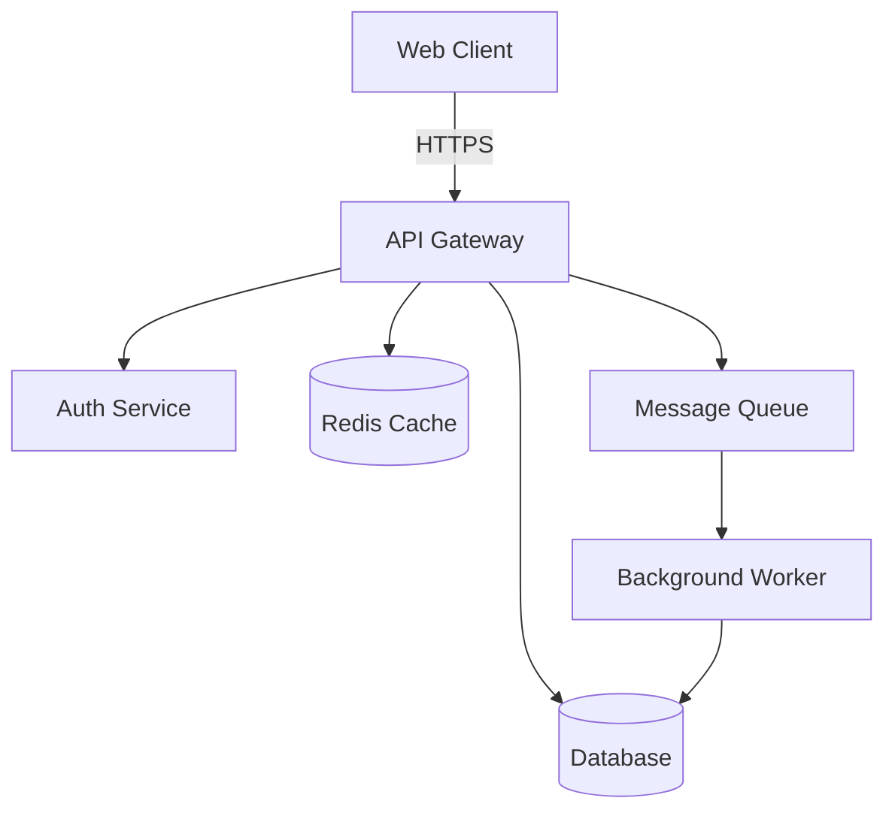
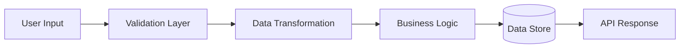
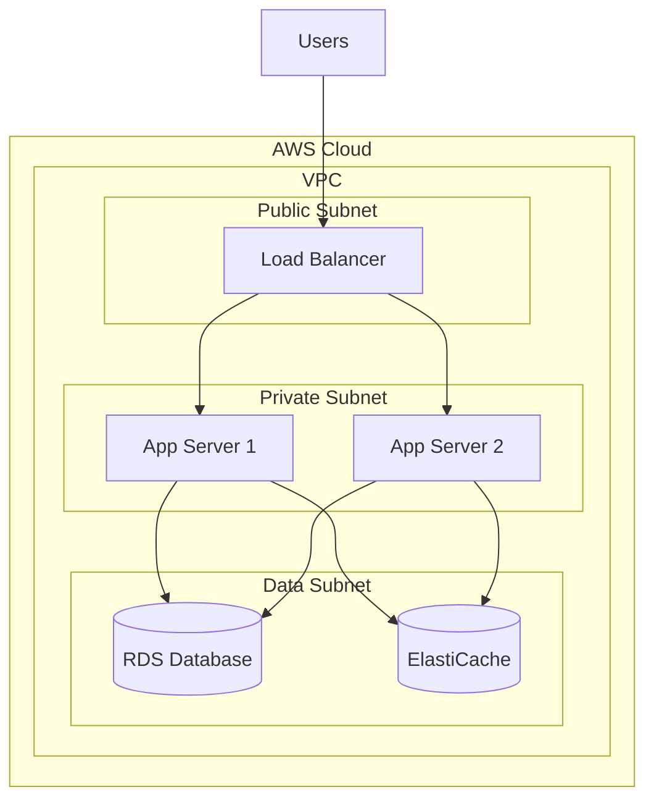
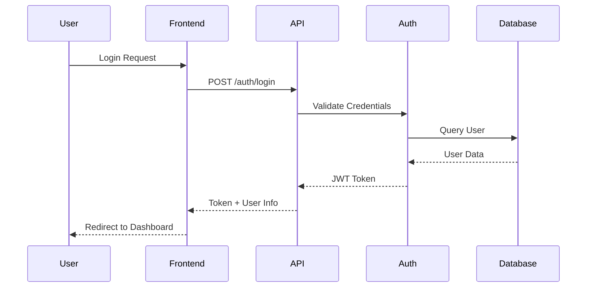

# Mermaid Diagram Patterns

## Architecture Diagrams

Use flowcharts or C4 diagrams for system architecture:

## Data Flow Diagrams

Use flowcharts with clear directional flow:

## Deployment Diagrams

Use C4 deployment diagrams or structured flowcharts:

## Sequence Diagrams

Use sequence diagrams for interactions over time:

## Best Practices

- Use descriptive node names
- Group related components in subgraphs
- Show clear data flow direction
- Include relevant protocols (HTTPS, gRPC, etc.)
- Use appropriate shapes: rectangles for services, cylinders for databases, etc.
