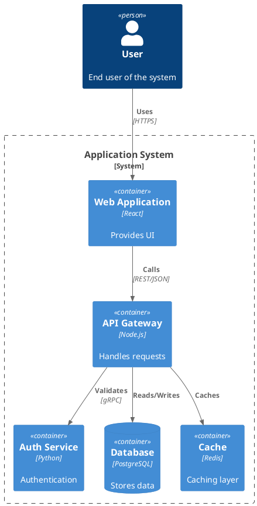
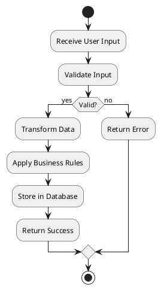
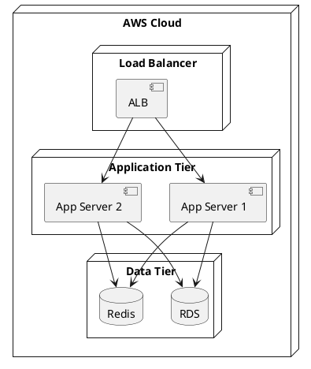
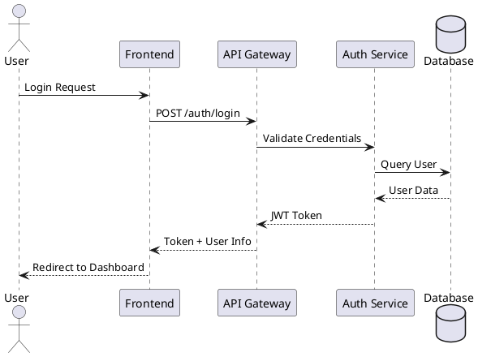

# PlantUML Diagram Patterns

## Architecture Diagrams

Use component diagrams for system architecture:

## Data Flow Diagrams

Use activity diagrams for data flow:

## Deployment Diagrams

Use deployment diagrams for infrastructure:

## Sequence Diagrams

Use sequence diagrams for interactions:

## Best Practices

- Use C4 model for architecture diagrams when possible
- Include stereotypes and technologies in component descriptions
- Use appropriate diagram types: component, deployment, sequence, activity
- Add notes for complex interactions
- Use colors and styling to highlight important components
